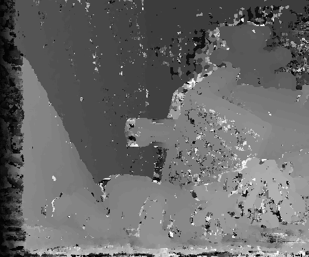
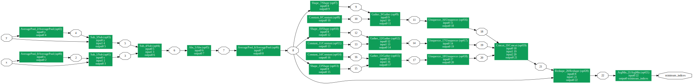

# trt_stereo
***trt_stereo*** is an experimental implementation for block matchig stereo algorithm using Cupy, PyTorch and TensorRT.
It uses on zero mean sum of absolute difference cost (ZSAD) and compute integer disparity.





## Requirements
***trt_stereo*** requires the following libraries:
+ cupy
+ pillow
+ torch
+ tensorrt
```sh
pip install -r requirement.txt
```

## Usage
```sh
# compute disparity and export ONNX model
python Python/zsad_model.py

# build TensorRT Engine
trtexec --shapes=x:1x1x375x450,y:1x62x375x450 --onnx=zsad.onnx --saveEngine=zsad_engine.trt
trtexec --shapes=x:1x1x375x450,y:1x62x375x450 --onnx=zsad.onnx --saveEngine=zsad_engine_fp16.trt --inputIOFormats=fp16:chw --fp16

# execute TensorRT Engine
python Python/zsad_trt.py
```
